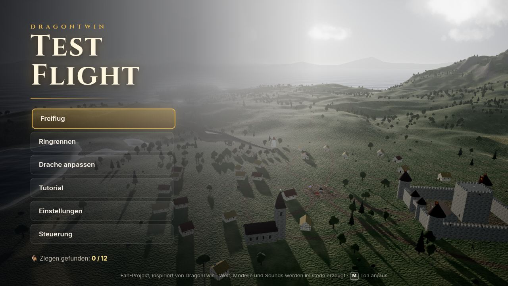
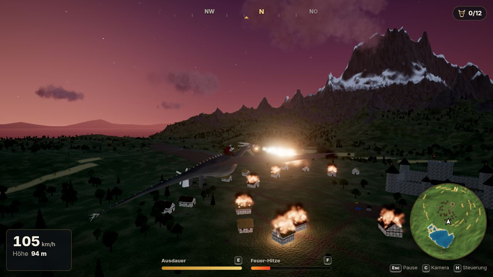
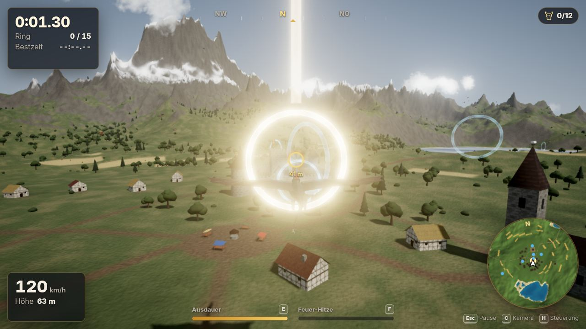
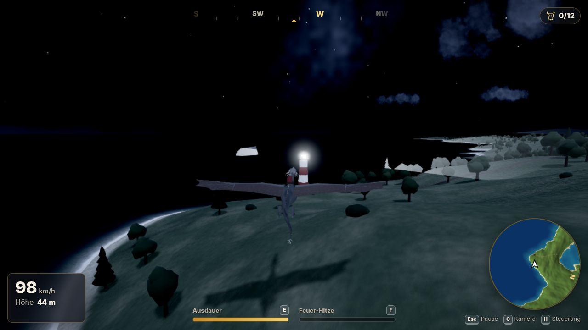

# 🐉 DragonTwin: Test Flight

Ein Drachen-Flugspiel für den Browser, gebaut mit **Three.js** und **Vite**.
Inspiriert vom „Test Flight“ aus DragonTwin.

Alles wird **im Code erzeugt**:

- Landschaft
- Drache
- Dorf
- Texturen
- Musik und Geräusche

Es werden keine Bilder oder Sounds heruntergeladen.



---

## ▶️ Spiel starten

**Voraussetzung:** [Node.js](https://nodejs.org) ab Version 18.

```bash
npm install
npm run dev
```

- Der Browser öffnet sich automatisch.
- Falls nicht: **http://localhost:5173** öffnen.
- Auf **„Los geht's“** klicken. Erst dann darf der Browser Ton abspielen.

Für eine fertige Version zum Hochladen gibt es `npm run build`. Das Ergebnis liegt dann im Ordner `dist/`.

---

## 🎮 Steuerung

| Aktion | Tastatur | Gamepad |
| --- | --- | --- |
| Nase hoch / runter | **S** / **W** (oder ↓ / ↑) | Linker Stick |
| Rollen / Kurve | **A** / **D** (oder ← / →) | Linker Stick |
| Flügelschlag | **Leertaste** | A |
| Sturzflug (Flügel anlegen) | **Shift** | B |
| Boost (kostet Ausdauer) | **E** oder **Strg** | RT |
| Feuer speien | **F** | X |
| Bremsen / Schweben | **V** | LT |
| Kamera (Reiter-Sicht) | **C** | Y |
| Brüllen | **Q** | RB |
| Rennen neu starten | **R** | LB |
| HUD ein/aus (Fotomodus) | **P** | – |
| Steuerung anzeigen | **H** | Back |
| Ton an/aus | **M** | – |
| Pause | **Esc** | Start |

- **Maus:** Taste gedrückt halten = umsehen. Mausrad = Zoom.
- **Tasten ändern:** *Einstellungen → Tasten*. Jede Aktion kann zwei Tasten haben.
- **Gelandet?** Mit W läuft der Drache. Mit der Leertaste hebt er wieder ab.

> ⚠️ **Warum liegt Boost auf E und nicht nur auf Strg?**
> Im Browser schliesst **Strg + W** den Tab. Beim Fliegen drückt man W und Boost oft gleichzeitig.
> Darum ist **E** die Haupttaste. Strg funktioniert trotzdem.
> Zusätzlich fragt der Browser nach, bevor er den Tab während des Fluges schliesst.

---

## ✨ Was ist drin?

### Fliegen
- **Physik-Flug** mit Auftrieb, Luftwiderstand, Schub und Schwerkraft.
- **Flügelschlag, Sturzflug, Boost** mit Ausdauer-Balken.
- **Schweben** und **Landen**. Am Boden kann der Drache laufen.
- **Flughilfe** (in den Einstellungen abschaltbar):
  - Der Drache fliegt ohne Eingabe geradeaus.
  - A/D stellen die Schräglage ein.
  - Loopings gelingen aus hohem Tempo.
- **Kameras:** Verfolger-Kamera (weich, mit Schwung) und Reiter-Sicht.

### Feuer
- Flammenstrahl aus Partikeln mit **echtem Licht**.
- **Überhitzung:** Zu langes Feuer → die Flamme stottert, bis der Drache abkühlt.
- **Brennbar sind:** Bäume, Hütten, Heuballen, Wachtürme, die Windmühle und Marktstände.
- Feuer **breitet sich aus**. Regen löscht es.
- Brandflecken bleiben auf dem Boden.

### Welt
- 5 × 5 km Insel mit:
  - Bergen (der grosse heisst „Drachenhorn“)
  - See, Fluss und Küste
  - Felsbogen im Meer
  - Schiffswrack und Steinkreis
- Dorf mit Burg, Kirche, Windmühle, ca. 28 Fachwerkhütten, Feldern und einem Fischerdorf.
- Leuchtturm mit drehendem Lichtstrahl in der Nacht.
- **Tag/Nacht-Zyklus:** Sonne, Mond, Sterne, Milchstrasse. Nachts leuchten die Fenster.
- **Wetter:** Klar, Bewölkt, Regen, Nebel und Gewitter (mit Blitz und Donner).
- **Wolken**, durch die man hindurchfliegen kann.
- Vogelschwärme, die vor dem Drachen fliehen.

### Spielmodi
- **Freiflug:** freies Erkunden.
- **Ringrennen:** 2 Strecken mit Countdown, Zwischenzeiten, Medaillen und Bestzeit.
  Dazu ein **Geist** deiner besten Runde.
- **Tutorial:** erklärt jede Steuerung Schritt für Schritt. Kann übersprungen werden.
- **12 versteckte Ziegen** 🐐
  - Hör genau hin: Ziegen in der Nähe meckern ab und zu.
  - Brüllen (Q) lockt sie auch.
  - Wer alle findet, schaltet eine geheime Drachenfarbe frei.

### Anpassen
- **Schuppenfarben:** Grau (Standard, wie im DragonTwin-Bild), Schwarz, Stahlblau, Moosgrün, Rostrot, Knochenweiss (+ 1 geheime).
- **Feuerfarben:** Orange, Rot, Blau, Grün, Violett, Pink, Dunkelrot.
- **Reiter** an oder aus.
- Alles wirkt **sofort** und wird gespeichert.

### Technik
- **Post-Processing:** Bloom, Vignette, ACES-Tonemapping, Tempo-Unschärfe beim Boost.
- **Schatten** folgen dem Drachen.
- **Performance:**
  - Instancing für Tausende Bäume.
  - Aufteilung der Welt in Stücke (nur Sichtbares wird gezeichnet).
  - Die automatische Qualität passt die Auflösung an die FPS an.
- **Ton:** alles synthetisch mit der Web Audio API.
  - Wind, der mit dem Tempo lauter wird
  - Flügelschläge, Feuer, Regen, Donner
  - Vögel am Tag, Grillen in der Nacht
  - Ring-Glocke, Ziegen-Meckern, Drachen-Gebrüll
  - Mittelalterliche Musik, die live erzeugt wird
- Einstellungen, Bestzeiten, Geister und gefundene Ziegen werden im **localStorage** gespeichert.





---

## 🧭 Projektstruktur

```
index.html              Grundgerüst: alle Menüs und das HUD
src/
  main.js               Start: Renderer, Laden, Hauptschleife
  core/
    Game.js             "Dirigent": Zustände (Menü, Flug, Rennen, Pause …)
    Input.js            Tastatur, Maus, Gamepad, Tasten neu belegen
    AudioManager.js     Alle Geräusche (synthetisch)
    Music.js            Prozedurale Musik (Harfe, Flöte, Trommeln)
    CameraRig.js        Kameras (Verfolger, Reiter, Menü, Schaufenster)
    Settings.js         Einstellungen (gespeichert)
    noise.js, utils.js  Rauschen und Mathe-Helfer
  world/
    Terrain.js          Landschaft aus Rauschen + Formen (See, Fluss, Küste)
    Sky.js              Himmel, Sonne, Mond, Sterne, Licht
    Weather.js          Wetter-Zustände mit weichen Übergängen
    Clouds.js           Wolken zum Durchfliegen
    Water.js            Wasser mit Wellen, Spiegelung, Ufer-Schaum
    Vegetation.js       Bäume, Büsche, Felsen (Instancing)
    Settlement.js       Dorf, Burg, Kirche, Windmühle, Leuchtturm …
    Landmarks.js        Felsbogen, Wrack, Steinkreis, ferne Berge
    Goats.js            Die versteckten Ziegen
    Birds.js            Vogelschwärme
    Colliders.js        Kollision mit Gebäuden
    World.js            Baut alles zusammen
  dragon/
    Dragon.js           Drachen-Modell + Animation (Knochen/Skinning)
    Wing.js             Flügel mit Fingerknochen und Flughaut
    FlightPhysics.js    ⭐ Die Flugphysik (ausführlich kommentiert)
    FireBreath.js       Feuer speien + Überhitzung
    Customization.js    Farben und Reiter
  gameplay/
    RingRace.js         Ringrennen
    Courses.js          Die zwei Strecken
    GhostReplay.js      Geist aufnehmen / abspielen
    Tutorial.js         Tutorial-Schritte
    BurnSystem.js       Was brennt wie lange, Ausbreitung
  fx/
    Particles.js        Partikel (Feuer, Rauch, Funken, Gischt)
    PostProcessing.js   Bloom, Farbkorrektur, Vignette
    Rain.js             Regen + Tempo-Streifen
    Lightning.js        Blitze
    Textures.js         Alle Texturen, im Code gemalt
  ui/
    HUD.js, Menu.js, Minimap.js, styles.css
```

---

## 🪽 Wie funktioniert die Flugphysik?

Ein fliegender Körper spürt **vier Kräfte**:

1. **Schwerkraft** zieht nach unten (9.81 m/s²).
2. **Auftrieb** entsteht an den Flügeln und steht **senkrecht** zur Flugrichtung.
3. **Luftwiderstand** bremst **gegen** die Flugrichtung.
4. **Schub** kommt hier vom Flügelschlag und vom Boost.

Für Auftrieb und Widerstand gilt dieselbe Formel:

```
Kraft = ½ · Luftdichte · Geschwindigkeit² · Flügelfläche · Beiwert
```

**Wichtig ist das „Geschwindigkeit²“:** Doppelt so schnell bedeutet **viermal** so viel Auftrieb.
Darum muss der Drache Tempo haben, um zu gleiten.

Der **Beiwert** hängt vom **Anstellwinkel** ab. Das ist der Winkel zwischen Nase und Flugrichtung.
- Mehr Winkel bedeutet mehr Auftrieb, aber nur bis ca. 20°.
- Danach reisst die Strömung ab (**Strömungsabriss**).

Jede 1/120 Sekunde rechnet das Spiel:

```
Beschleunigung = Summe aller Kräfte
Geschwindigkeit += Beschleunigung · Zeitschritt
Position        += Geschwindigkeit · Zeitschritt
```

Das steht Schritt für Schritt kommentiert in `src/dragon/FlightPhysics.js`.
Die Zahlen oben in der Datei (z. B. `K_AIR`, `CL_ALPHA`, `MAX_G`) kannst du ändern und ausprobieren.

---

## ⚙️ Tipps zur Leistung

- **Einstellungen → Grafik:**
  - **Automatisch** senkt die Auflösung, wenn die FPS unter ca. 48 fallen.
  - **Niedrig** schaltet Schatten und Bloom aus.
- Die **Baumdichte** ändert sich erst nach dem Neuladen der Seite.
- **FPS anzeigen** gibt es unter *Einstellungen → Grafik*.

---

## ✂️ Was (noch) nicht drin ist

Die „Stretch Goals“ aus der Vorgabe gehören **nicht** zum Test Flight. Sie sind jeweils ein eigenes Grossprojekt:

- Drachen-Editor (Körperform, Hörner …)
- Rüstung für den Reiter
- Weltkarte mit mehreren Regionen
- Quests
- Zerstörbare Gebäude (Hütten brennen ab, stürzen aber nicht ein)
- Armeen und feindliche Drachen
- Die Höhle (Lair)
- Strategie-Modus
- Mehrspieler

**Vereinfacht wurde:**

- **Wasser-Spiegelung:** Das Wasser spiegelt den Himmel, aber nicht die Berge. Das ist viel schneller.
- **Drachen-Modell:** Der Drache ist ein **Wyvern** wie in DragonTwin: Die Flügel sind die Arme, es gibt nur zwei Hinterbeine. Er wird komplett im Code gebaut (mit Leder-Normal-Map, Flecken und Hornkrone). Ein professionell modellierter Drache aus Blender wäre noch detailreicher.
- **Der Test lief ohne Grafikkarte:**
  - Getestet wurde automatisch in einem Browser ohne GPU.
  - Die Logik braucht nur ca. 2 ms pro Bild.
  - Die echten FPS auf deinem Laptop konnte ich nicht messen.

---

## 🖼️ Echte Foto-Texturen (optional, später)

Geplant sind kostenlose **CC0-Texturen** von [Poly Haven](https://polyhaven.com) (Fels, Gras, Holz …).
CC0 bedeutet: frei nutzbar, auch ohne Namensnennung.
Dafür muss die Cloud-Umgebung die Domains `polyhaven.com` bzw. `ambientcg.com` erlauben.

---

## 📜 Lizenzen

- **Code:** selbst geschrieben für dieses Projekt.
- **Schriften:** [Cinzel](https://fontsource.org/fonts/cinzel) und [Inter](https://fontsource.org/fonts/inter).
  - Lizenz: SIL Open Font License.
  - Sie werden lokal über npm eingebunden.
- **Three.js:** MIT-Lizenz.
- Alle Texturen, Modelle und Geräusche entstehen im Code.

Dies ist ein **Fan-Projekt**, inspiriert von *DragonTwin*. Es ist kein offizielles Produkt.
