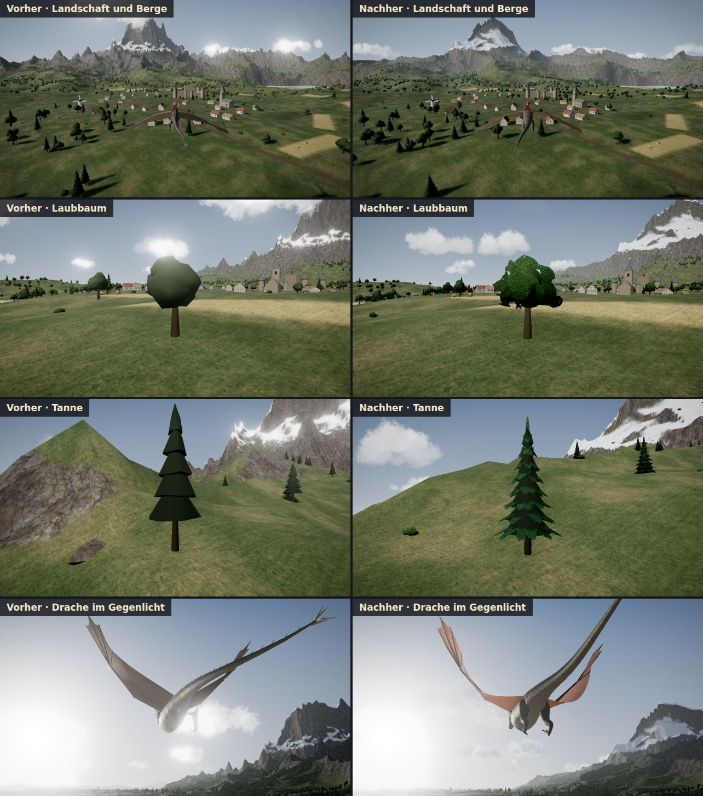
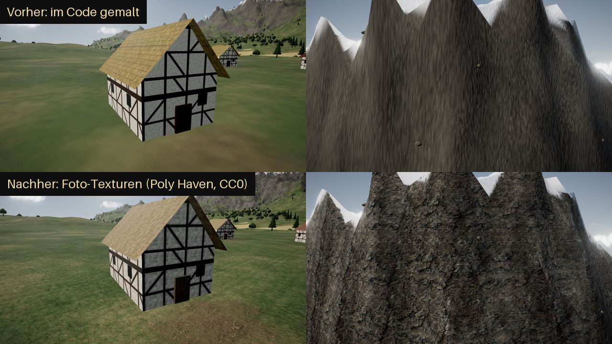

# 🐉 DragonTwin: Test Flight

Ein Drachen-Flugspiel für den Browser, gebaut mit **Three.js** und **Vite**.
Inspiriert vom „Test Flight“ aus DragonTwin.

Fast alles wird **im Code erzeugt**:

- Landschaft
- Bäume (Blätter- und Nadel-Texturen werden im Code gemalt)
- Dorf
- Musik und Geräusche
- Drache: ein 3D-Modell, das ein **Skript in Blender** baut (`tools/build_dragon.py` → `public/models/dragon_scales.glb`)

**Ausnahme: Foto-Texturen.** Boden und Gebäude benutzen 10 echte Foto-Texturen
von [Poly Haven](https://polyhaven.com) (Lizenz CC0, frei nutzbar).
Sie liegen im Projekt (`public/textures/`), das Spiel lädt nichts aus dem Internet.
Mehr dazu unten im Abschnitt **Foto-Texturen**.


---

## ▶️ Spiel starten

**Voraussetzung:** [Node.js](https://nodejs.org) ab Version 18.

```bash
npm install
npm run dev
```

- Der Browser öffnet sich automatisch.
- Falls nicht: **http://localhost:5173** öffnen.
- Auf **„Los geht's“** klicken. Erst dann darf der Browser Ton abspielen.

Für eine fertige Version zum Hochladen gibt es `npm run build`. Das Ergebnis liegt dann im Ordner `dist/`.

---

## 🎮 Steuerung

| Aktion | Tastatur | Gamepad |
| --- | --- | --- |
| Nase hoch / runter | **S** / **W** (oder ↓ / ↑) | Linker Stick |
| Rollen / Kurve | **A** / **D** (oder ← / →) | Linker Stick |
| Flügelschlag | **Leertaste** | A |
| Sturzflug (Flügel anlegen) | **Shift** | B |
| Boost (kostet Ausdauer) | **E** oder **Strg** | RT |
| Feuer speien | **F** | X |
| Bremsen / Schweben | **V** | LT |
| Kamera (Reiter-Sicht) | **C** | Y |
| Brüllen | **Q** | RB |
| Rennen neu starten | **R** | LB |
| HUD ein/aus (Fotomodus) | **P** | – |
| Steuerung anzeigen | **H** | Back |
| Ton an/aus | **M** | – |
| Pause | **Esc** | Start |

- **Maus:** Taste gedrückt halten = umsehen. Mausrad = Zoom.
- **Tasten ändern:** *Einstellungen → Tasten*. Jede Aktion kann zwei Tasten haben.
- **Gelandet?** Mit W läuft der Drache. Mit der Leertaste hebt er wieder ab.

> ⚠️ **Warum liegt Boost auf E und nicht nur auf Strg?**
> Im Browser schliesst **Strg + W** den Tab. Beim Fliegen drückt man W und Boost oft gleichzeitig.
> Darum ist **E** die Haupttaste. Strg funktioniert trotzdem.
> Zusätzlich fragt der Browser nach, bevor er den Tab während des Fluges schliesst.

---

## ✨ Was ist drin?

### Fliegen
- **Physik-Flug** mit Auftrieb, Luftwiderstand, Schub und Schwerkraft.
- **Flügelschlag, Sturzflug, Boost** mit Ausdauer-Balken.
- **Schweben** und **Landen**. Am Boden kann der Drache laufen.
- **Flughilfe** (in den Einstellungen abschaltbar):
  - Der Drache fliegt ohne Eingabe geradeaus.
  - A/D stellen die Schräglage ein.
  - Loopings gelingen aus hohem Tempo.
- **Kameras:** Verfolger-Kamera (weich, mit Schwung) und Reiter-Sicht.

### Feuer
- Flammenstrahl aus Partikeln mit **echtem Licht**.
- **Überhitzung:** Zu langes Feuer → die Flamme stottert, bis der Drache abkühlt.
- **Brennbar sind:** Bäume, Hütten, Heuballen, Wachtürme, die Windmühle und Marktstände.
- Feuer **breitet sich aus**. Regen löscht es.
- Brandflecken bleiben auf dem Boden.

### Welt
- 5 × 5 km Insel mit:
  - Bergen (der grosse heisst „Drachenhorn“)
  - See, Fluss und Küste
  - Felsbogen im Meer
  - Schiffswrack und Steinkreis
- Dorf mit Burg, Kirche, Windmühle, ca. 28 Fachwerkhütten, Feldern und einem Fischerdorf.
- **Foto-Texturen** für Gras, Fels, Sand, Schnee, Wege, Holz, Stroh, Stein, Putz und Schiefer.
- Leuchtturm mit drehendem Lichtstrahl in der Nacht.
- **Tag/Nacht-Zyklus:** Sonne, Mond, Sterne, Milchstrasse. Nachts leuchten die Fenster.
- **Wetter:** Klar, Bewölkt, Regen, Nebel und Gewitter (mit Blitz und Donner).
- **Wolken**, durch die man hindurchfliegen kann.
- Vogelschwärme, die vor dem Drachen fliehen.

### Spielmodi
- **Freiflug:** freies Erkunden.
- **Ringrennen:** 2 Strecken mit Countdown, Zwischenzeiten, Medaillen und Bestzeit.
  Dazu ein **Geist** deiner besten Runde.
- **Tutorial:** erklärt jede Steuerung Schritt für Schritt. Kann übersprungen werden.
- **12 versteckte Ziegen** 🐐
  - Hör genau hin: Ziegen in der Nähe meckern ab und zu.
  - Brüllen (Q) lockt sie auch.
  - Wer alle findet, schaltet eine geheime Drachenfarbe frei.

### Anpassen
- **Schuppenfarben:** Grau (Standard, wie im DragonTwin-Bild), Schwarz, Stahlblau, Moosgrün, Rostrot, Knochenweiss (+ 1 geheime).
- **Feuerfarben:** Orange, Rot, Blau, Grün, Violett, Pink, Dunkelrot.
- **Reiter** an oder aus.
- Alles wirkt **sofort** und wird gespeichert.

### Technik
- **Drache als 3D-Modell (GLB)** mit Skelett: 50 Knochen bewegen Flügel, Hals, Kiefer, Schwanz und Beine.
  Im Gegenlicht scheint die Flughaut rötlich durch.
- **Bäume aus „Karten“:** kleine Flächen mit Blätter- bzw. Nadel-Textur, deren Ränder ausgestanzt werden → blättrige Umrisse.
- **Luft-Perspektive:** Dunst ist unten dichter als oben, in Richtung Sonne leuchtet er warm. Nebel-Wetter liegt am Boden.
- **Berge mit Erosion:** scharfe Hauptgrate, glatte Flanken statt „Haifischzähne“.
- **Post-Processing:** Bloom, Vignette, ACES-Tonemapping, Tempo-Unschärfe beim Boost.
- **Boden-Shader:** mischt 5 Foto-Schichten (Gras, Fels, Sand, Schnee, Erde) je nach Höhe und Steilheit.
  Felswände werden von drei Seiten projiziert („triplanar“), damit nichts verzerrt.
- **Schatten** folgen dem Drachen.
- **Performance:**
  - Instancing für Tausende Bäume.
  - Aufteilung der Welt in Stücke (nur Sichtbares wird gezeichnet).
  - Die automatische Qualität passt die Auflösung an die FPS an.
- **Ton:** alles synthetisch mit der Web Audio API.
  - Wind, der mit dem Tempo lauter wird
  - Flügelschläge, Feuer, Regen, Donner
  - Vögel am Tag, Grillen in der Nacht
  - Ring-Glocke, Ziegen-Meckern, Drachen-Gebrüll
  - Mittelalterliche Musik, die live erzeugt wird
- Einstellungen, Bestzeiten, Geister und gefundene Ziegen werden im **localStorage** gespeichert.


---

## 🧭 Projektstruktur

```
index.html              Grundgerüst: alle Menüs und das HUD
src/
  main.js               Start: Renderer, Laden, Hauptschleife
  core/
    Game.js             "Dirigent": Zustände (Menü, Flug, Rennen, Pause …)
    Input.js            Tastatur, Maus, Gamepad, Tasten neu belegen
    AudioManager.js     Alle Geräusche (synthetisch)
    Music.js            Prozedurale Musik (Harfe, Flöte, Trommeln)
    CameraRig.js        Kameras (Verfolger, Reiter, Menü, Schaufenster)
    Settings.js         Einstellungen (gespeichert)
    noise.js, utils.js  Rauschen und Mathe-Helfer
  world/
    Terrain.js          Landschaft aus Rauschen + Formen (See, Fluss, Küste)
    Sky.js              Himmel, Sonne, Mond, Sterne, Licht
    Weather.js          Wetter-Zustände mit weichen Übergängen
    Clouds.js           Wolken zum Durchfliegen (Volumen-Licht, flacher Boden)
    Water.js            Wasser mit Wellen, Spiegelung, Ufer-Schaum
    Vegetation.js       Bäume, Büsche, Felsen (Instancing), Wald-Karte für den Boden
    TreeModels.js       Baum-Modelle + im Code gemalte Blätter-/Nadel-Texturen
    Settlement.js       Dorf, Burg, Kirche, Windmühle, Leuchtturm …
    Landmarks.js        Felsbogen, Wrack, Steinkreis, ferne Berge
    Goats.js            Die versteckten Ziegen
    Birds.js            Vogelschwärme
    Colliders.js        Kollision mit Gebäuden
    World.js            Baut alles zusammen
  dragon/
    Dragon.js           Lädt das Drachen-Modell (GLB) und bewegt die Knochen
    Wing.js             (alt, wird nicht mehr benutzt – kann gelöscht werden)
    FlightPhysics.js    ⭐ Die Flugphysik (ausführlich kommentiert)
    FireBreath.js       Feuer speien + Überhitzung
    Customization.js    Farben und Reiter
  gameplay/
    RingRace.js         Ringrennen
    Courses.js          Die zwei Strecken
    GhostReplay.js      Geist aufnehmen / abspielen
    Tutorial.js         Tutorial-Schritte
    BurnSystem.js       Was brennt wie lange, Ausbreitung
  fx/
    Particles.js        Partikel (Feuer, Rauch, Funken, Gischt)
    PostProcessing.js   Bloom, Farbkorrektur, Vignette
    Atmosphere.js       Höhen-Dunst und Sonne im Dunst (für alle Materialien)
    Rain.js             Regen + Tempo-Streifen
    Lightning.js        Blitze
    PhotoTextures.js    Foto-Texturen laden (Boden, Gebäude, Felsen)
    Textures.js         Im Code gemalte Texturen (Ersatz, falls Fotos fehlen)
  ui/
    HUD.js, Menu.js, Minimap.js, styles.css
public/textures/        Die Foto-Texturen (JPG) + QUELLEN.md mit Autoren
public/models/          Das Drachen-Modell (GLB) + QUELLEN.md
tools/
  fetch_textures.py     Lädt die Foto-Texturen von Poly Haven und bereitet sie vor
  build_dragon.py       Baut den Drachen in Blender (bpy) und exportiert die GLB
  dragon_scales_bones.json   Knochen, Masse und Ankerpunkte des Drachen
  dragon_scales_report.md    Bericht: wie der Drache entstanden ist und geprüft wurde
```

---

## 🪽 Wie funktioniert die Flugphysik?

Ein fliegender Körper spürt **vier Kräfte**:

1. **Schwerkraft** zieht nach unten (9.81 m/s²).
2. **Auftrieb** entsteht an den Flügeln und steht **senkrecht** zur Flugrichtung.
3. **Luftwiderstand** bremst **gegen** die Flugrichtung.
4. **Schub** kommt hier vom Flügelschlag und vom Boost.

Für Auftrieb und Widerstand gilt dieselbe Formel:

```
Kraft = ½ · Luftdichte · Geschwindigkeit² · Flügelfläche · Beiwert
```

**Wichtig ist das „Geschwindigkeit²“:** Doppelt so schnell bedeutet **viermal** so viel Auftrieb.
Darum muss der Drache Tempo haben, um zu gleiten.

Der **Beiwert** hängt vom **Anstellwinkel** ab. Das ist der Winkel zwischen Nase und Flugrichtung.
- Mehr Winkel bedeutet mehr Auftrieb, aber nur bis ca. 20°.
- Danach reisst die Strömung ab (**Strömungsabriss**).

Jede 1/120 Sekunde rechnet das Spiel:

```
Beschleunigung = Summe aller Kräfte
Geschwindigkeit += Beschleunigung · Zeitschritt
Position        += Geschwindigkeit · Zeitschritt
```

Das steht Schritt für Schritt kommentiert in `src/dragon/FlightPhysics.js`.
Die Zahlen oben in der Datei (z. B. `K_AIR`, `CL_ALPHA`, `MAX_G`) kannst du ändern und ausprobieren.

---

## ⚙️ Tipps zur Leistung

- **Einstellungen → Grafik:**
  - **Automatisch** senkt die Auflösung, wenn die FPS unter ca. 48 fallen.
  - **Niedrig** schaltet Schatten und Bloom aus.
    Der Boden benutzt dann eine einfachere Version der Foto-Texturen (weniger Textur-Zugriffe).
- Die **Baumdichte** ändert sich erst nach dem Neuladen der Seite.
- **FPS anzeigen** gibt es unter *Einstellungen → Grafik*.

---

## ✂️ Was (noch) nicht drin ist

Die „Stretch Goals“ aus der Vorgabe gehören **nicht** zum Test Flight. Sie sind jeweils ein eigenes Grossprojekt:

- Drachen-Editor (Körperform, Hörner …)
- Rüstung für den Reiter
- Weltkarte mit mehreren Regionen
- Quests
- Zerstörbare Gebäude (Hütten brennen ab, stürzen aber nicht ein)
- Armeen und feindliche Drachen
- Die Höhle (Lair)
- Strategie-Modus
- Mehrspieler

**Vereinfacht wurde:**

- **Wasser-Spiegelung:** Das Wasser spiegelt den Himmel, aber nicht die Berge. Das ist viel schneller.
- **Drachen-Modell:** Der Drache ist ein **Wyvern** wie in DragonTwin: Die Flügel sind die Arme, es gibt nur zwei Hinterbeine. Ein Skript baut ihn in Blender aus Formeln (ca. 63 000 Dreiecke, gebackene Schuppen-Texturen). Ein von Hand modellierter Drache (z. B. „Scales“ aus dem Film *Sintel*) wäre noch detailreicher – der ist aber nur mit Abo herunterladbar.
- **Keine Umgebungsverdeckung am Bildschirm (SSAO):** Dafür müsste die ganze Szene mit allen Bäumen ein zweites Mal gezeichnet werden. Stattdessen: dunklerer Waldboden (Wald-Karte) und dunklere Innenseiten der Baumkronen.
- **Der Test lief ohne Grafikkarte:**
  - Getestet wurde automatisch in einem Browser ohne GPU.
  - Die Logik braucht nur ca. 2 ms pro Bild.
  - Die echten FPS auf deinem Laptop konnte ich nicht messen.

---

## 🌲 Realistischer Look



| Was | Vorher | Nachher | Datei |
| --- | --- | --- | --- |
| Drache | aus Röhren und Kugeln im Code | 3D-Modell mit Skelett, Schuppen, durchscheinender Flughaut | `src/dragon/Dragon.js`, `tools/build_dragon.py` |
| Bäume | Kugeln und Kegel | Kern + viele Blätter-/Nadel-Karten, zittern im Wind, Schatten mit Blatt-Umriss | `src/world/TreeModels.js` |
| Berge | viele gleich hohe Spitzen | erodierte Grate, glatte Flanken, grosse Massive | `src/core/noise.js`, `src/world/Terrain.js` |
| Luft | gleichmässiger Nebel | Dunst unten dichter, Sonne leuchtet im Dunst, Bodennebel | `src/fx/Atmosphere.js` |
| Wolken | helle Kleckse | Licht von der Sonnenseite, grauer flacher Boden, Silberrand | `src/world/Clouds.js` |
| Waldboden | gleich hell | unter Bäumen dunkler (auch weit weg) | `src/world/Vegetation.js` |

**So wurde getestet:** Die Bilder oben sind echte Bildschirmfotos aus dem Spiel
(gleiche Kamera, gleiche Uhrzeit), gemacht in einem Browser ohne Grafikkarte.
Wie schnell es auf deinem Computer läuft, konnte ich nicht messen – siehe *Tipps zur Leistung*.

---

## 🖼️ Foto-Texturen



### Welche Texturen?

Alle von [Poly Haven](https://polyhaven.com), Lizenz **CC0**.
CC0 bedeutet: frei nutzbar, auch ohne Namensnennung.
Die genaue Liste mit Autoren steht in [`public/textures/QUELLEN.md`](public/textures/QUELLEN.md).

| Textur | Wo im Spiel? |
| --- | --- |
| Gras | Wiesen, Felder (eingefärbt als Weizen / Acker) |
| Fels | Felshänge, Felsbrocken, Felsbogen, Steinkreis |
| Sand | Strand und Ufer |
| Schnee | Gipfel |
| Erde | Wege im Dorf |
| Holz | Türen, Marktstände, Wachtürme, Steg, Boote, Wrack |
| Stroh | Strohdächer, Heuballen |
| Stein | Burg, Kirche, Kamine, Brunnen |
| Putz + Holz | Fachwerk (wird beim Start aus beiden Fotos zusammengesetzt) |
| Schiefer | Dächer von Burg und Kirche; rötlich eingefärbt auch für die Ziegeldächer der Hütten |

### Wie funktioniert das?

Pro Textur gibt es **3 Bilder**:

- `_diff.jpg`: die **Farbe**
- `_nor.jpg`: die **Normal-Map**. Jedes Pixel speichert, in welche Richtung die Fläche zeigt.
  So wirkt der Boden rau und uneben, obwohl er flach ist.
- `_arh.jpg`: drei Graubilder in einem.
  - Rot = **AO** (Ritzen sind dunkler)
  - Grün = **Rauheit** (matt oder glänzend)
  - Blau = **Höhe** (für schöne Übergänge)

**Beim Boden** (`src/world/Terrain.js`) passiert Folgendes:

1. Der Shader entscheidet für jeden Punkt, wie viel Gras, Fels, Sand, Schnee oder Erde dort liegt.
   - Steil → Fels
   - Hoch → Schnee
   - Nah am Wasser → Sand
2. Das Foto wird **umgefärbt**: `Foto ÷ Durchschnittsfarbe × Wunschfarbe`.
   So bleiben die Details vom Foto, aber die Farben der Landschaft stimmen.
3. **Höhen-Überblendung:** Im Übergang setzt sich die „höhere“ Schicht zuerst durch.
   Beispiel: Steine ragen aus dem Gras. Das sieht natürlicher aus als ein weicher Verlauf.
4. **Gegen sichtbare Wiederholung:** Gras und Fels werden zusätzlich noch einmal in viel grösserem Massstab darübergelegt.

**Fällt etwas aus?** Fehlen die Bilder, nimmt das Spiel automatisch die alten, im Code gemalten Texturen.

**Vergleichen:** Öffne das Spiel mit `?fotos=0` am Ende der Adresse
(z. B. `http://localhost:5173/?fotos=0`). Dann siehst du die alte Version.

### Texturen neu herunterladen oder austauschen

Die Bilder liegen schon im Projekt. Nur wenn du sie ändern willst:

```bash
pip install pillow
python3 tools/fetch_textures.py
```

- Welche Poly-Haven-Texturen benutzt werden, steht oben im Skript (`TEXTURES = { ... }`).
- Das Skript lädt die Bilder, verkleinert sie (Boden 1024 px, Gebäude 512 px) und packt sie neu.
- Alles zusammen ist ca. **5 MB** gross.

> ⚠️ **Leistung:** Die Foto-Texturen brauchen mehr Grafik-Leistung als die gemalten.
> Im Test ohne Grafikkarte (Software-Rendering) dauerte ein Bild ca. 50 % länger,
> mit Grafik **„Niedrig“** noch ca. 25 % länger.
> Auf einer echten Grafikkarte ist der Unterschied vermutlich kleiner – messen konnte ich das hier aber nicht.

---

## 📜 Lizenzen

- **Code:** selbst geschrieben für dieses Projekt.
- **Schriften:** [Cinzel](https://fontsource.org/fonts/cinzel) und [Inter](https://fontsource.org/fonts/inter).
  - Lizenz: SIL Open Font License.
  - Sie werden lokal über npm eingebunden.
- **Three.js:** MIT-Lizenz.
- **Foto-Texturen:** [Poly Haven](https://polyhaven.com), Lizenz CC0. Autoren siehe [`public/textures/QUELLEN.md`](public/textures/QUELLEN.md).
- Alle Modelle, Geräusche und die übrigen Texturen entstehen im Code.

Dies ist ein **Fan-Projekt**, inspiriert von *DragonTwin*. Es ist kein offizielles Produkt.
