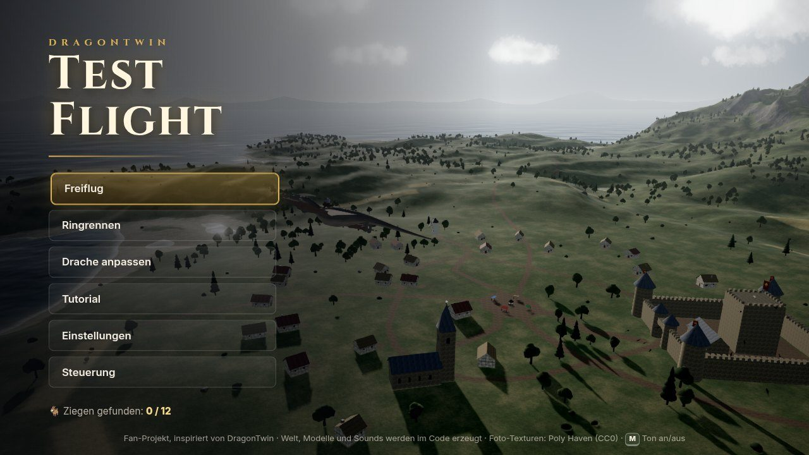
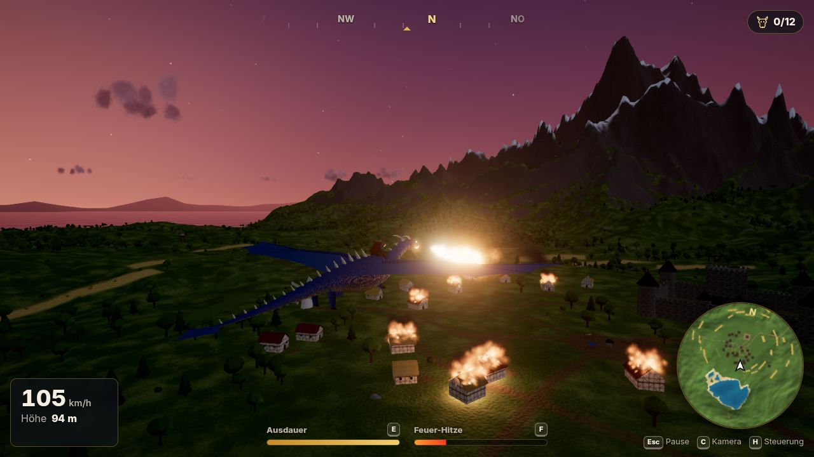
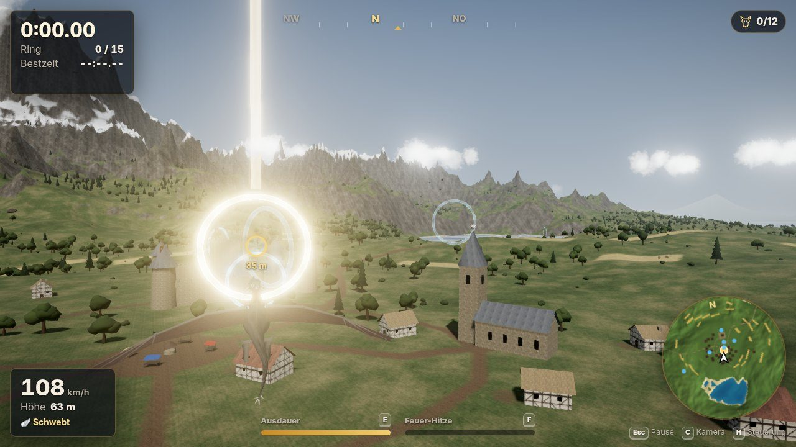
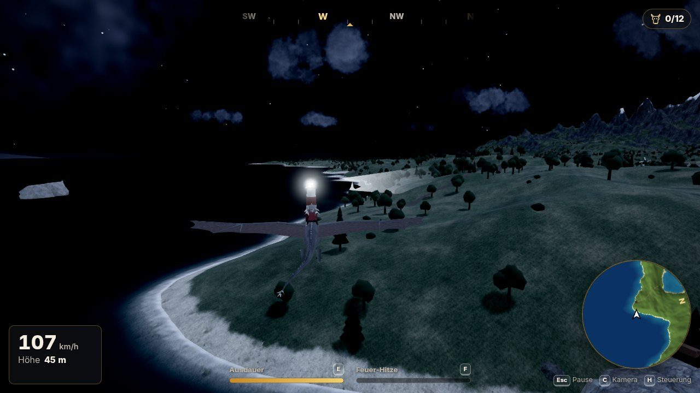
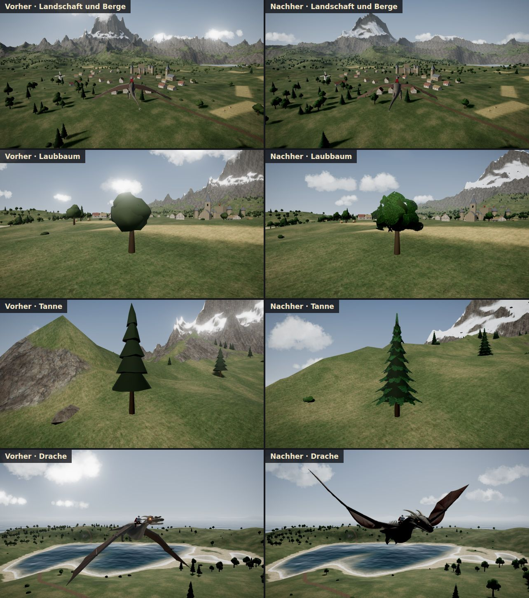
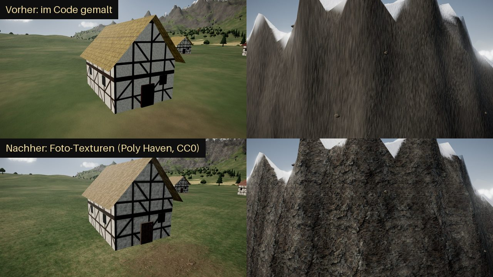

# 🐉 DragonTwin: Test Flight

Ein Drachen-Flugspiel für den Browser – und als eigenes Programm (Windows, Mac, Linux) –,
gebaut mit **Three.js** und **Vite**.
Inspiriert vom „Test Flight“ aus DragonTwin.

Fast alles wird **im Code erzeugt**:

- Landschaft
- Bäume (Blätter- und Nadel-Texturen werden im Code gemalt)
- Dorf
- Musik und Geräusche
- Drache: ein 3D-Modell, das ein **Skript in Blender** baut (`tools/build_dragon.py` → `public/models/dragon_scales.glb`)

**Ausnahme: Foto-Texturen.** Boden und Gebäude benutzen 10 echte Foto-Texturen
von [Poly Haven](https://polyhaven.com) (Lizenz CC0, frei nutzbar).
Sie liegen im Projekt (`public/textures/`), das Spiel lädt nichts aus dem Internet.
Mehr dazu unten im Abschnitt **Foto-Texturen**.



---

## ▶️ Spiel starten

**Voraussetzung:** [Node.js](https://nodejs.org) ab Version 22.12 (prüfen mit `node -v`).

```bash
npm install
npm run dev
```

- Der Browser öffnet sich automatisch.
- Falls nicht: **http://localhost:5173** öffnen.
- Auf **„Los geht's“** klicken. Erst dann darf der Browser Ton abspielen.

Für eine fertige Version zum Hochladen gibt es `npm run build`. Das Ergebnis liegt dann im Ordner `dist/`.

---

## 🖥️ Als Programm spielen (ohne Browser)

Das Spiel läuft auch als eigenes Programm – mit **Electron** (dieselbe Grafik-Technik wie Chrome,
darum gleich schnell). Kein Browser nötig, läuft offline.

```bash
npm install            # einmal
npm run desktop        # Spiel im eigenen Fenster starten
npm run desktop:exe    # Programm-Ordner mit DragonTwin.exe bauen
```

- **Beim ersten Start** lädt Electron sein Programm herunter (ungefähr 100 MB, offiziell von GitHub,
  mit Prüfsumme). Danach geht es offline.
- `npm run desktop:exe` baut den Ordner **`release/DragonTwin-win32-x64/`** (auf Windows).
  Darin: **`DragonTwin.exe`** – Doppelklick startet das Spiel.
  Immer den **ganzen Ordner** behalten oder weitergeben (gut 250 MB), nicht nur die .exe.
- **F11** = Vollbild. Das X oben schliesst das Spiel sofort (keine Nachfrage wie im Browser).
- **Strg + W** schliesst das Fenster nicht (im Spiel ist das „Nase hoch + Boost“).
- **Windows-Warnung beim ersten Start:** „Der Computer wurde durch Windows geschützt“.
  Grund: Das Programm ist nicht digital signiert (eine Signatur kostet Geld).
  Lösung: **„Weitere Informationen“ → „Trotzdem ausführen“**.
- **Spielstände** (Rang, Aufträge, Bestzeiten) sind im Programm getrennt vom Browser gespeichert.
- Technik: `electron/main.cjs` (Fenster), `electron/paths.cjs` (welche Dateien geladen werden dürfen),
  `electron/paket.mjs` (Programm-Ordner bauen), Test ohne Electron: `node electron/test.mjs`.

---

## 🎮 Steuerung

| Aktion | Tastatur | Gamepad |
| --- | --- | --- |
| Nase hoch / runter | **W** / **S** (oder ↑ / ↓) | Linker Stick (vor = hoch) |
| Rollen / Kurve | **A** / **D** (oder ← / →) | Linker Stick |
| Flügelschlag | **Leertaste** | A |
| Sturzflug (Flügel anlegen) | **Shift** | B |
| Boost (kostet Ausdauer) | **E** oder **Strg** | RT |
| Feuer speien | **F** | X |
| Bremsen / Schweben | **V** | LT |
| Landen (Landeanflug bis zum Boden) | **L** | Steuerkreuz ← |
| Kamera (Reiter-Sicht) | **C** | Y |
| Brüllen (wirft Soldaten um, erschreckt Feinde) | **Q** | RB |
| Biss / Sturzangriff | **X** | Steuerkreuz ↓ |
| Drachenhorn (eigene Truppen stürmen los) | **G** | Steuerkreuz ↑ |
| Gegner anvisieren (Ziel-Kamera) | **T** | Steuerkreuz → |
| Ausweichrolle | 2× schnell **A** oder **D** | – |
| Rennen neu starten | **R** | LB |
| HUD ein/aus (Fotomodus) | **P** | – |
| Steuerung anzeigen | **H** | Back |
| Ton an/aus | **M** | – |
| Pause | **Esc** | Start |

- **Maus:** Taste gedrückt halten = umsehen. Mausrad = Zoom.
- **Tasten ändern:** *Einstellungen → Tasten*. Jede Aktion kann zwei Tasten haben.
- **Landen:** **L** drücken (unter 150 m Höhe). Der Drache bremst, richtet sich auf, streckt die Beine vor
  und setzt sanft auf. Abbrechen: **L** nochmal oder **Leertaste**.
- **Gelandet?** Mit **W** läuft der Drache (S = rückwärts), mit **W + E** rennt er, mit **A/D** dreht er.
  Mit der **Leertaste** hebt er wieder ab.
- **W = Nase hoch** (seit dieser Version). Wer es wie im Flugzeug mag (S = hoch): *Einstellungen → Steuerung →
  Flugzeug-Steuerung*. Laufen bleibt dabei gleich (W = vorwärts).

> ⚠️ **Warum liegt Boost auf E und nicht nur auf Strg?**
> Im Browser schliesst **Strg + W** den Tab. Beim Fliegen drückt man W und Boost oft gleichzeitig.
> Darum ist **E** die Haupttaste. Strg funktioniert trotzdem.
> Zusätzlich fragt der Browser nach, bevor er den Tab während des Fluges schliesst.

---

## ✨ Was ist drin?

### Fliegen
- **Physik-Flug** mit Auftrieb, Luftwiderstand, Schub und Schwerkraft.
- **Flügelschlag, Sturzflug, Boost** mit Ausdauer-Balken.
- **Schweben** und **Landen**. Am Boden kann der Drache laufen.
- **Flughilfe** (in den Einstellungen abschaltbar):
  - Der Drache fliegt ohne Eingabe geradeaus.
  - A/D stellen die Schräglage ein.
  - Loopings gelingen aus hohem Tempo.
- **Kameras:** Verfolger-Kamera (weich, mit Schwung) und Reiter-Sicht.
- **Tempo spüren:**
  - Kondensstreifen an den Flügelspitzen (hohes Tempo, enge Kurven).
  - Im langen Sturzflug: Dampfkegel und bei 110 m/s die **„Schallmauer“** mit Knall und Druckwelle.
  - Boost mit Ruck und „Wusch“, Wind-Streifen, Kamera-Wackeln.
- **Kraft spüren:** schwere Landung mit Staubring und Beben, Flügelschläge wirbeln Staub oder Gischt auf,
  Brüllen (Q) mit Druckwelle.

### Feuer
- Flammenstrahl aus Partikeln mit **echtem Licht**, Glut und Funken.
- **Flammenwalze:** Wo das Feuer den Boden trifft, spritzen die Flammen zur Seite.
- Gebäude gehen mit **Stichflamme, Funkenregen und Knall** in Flammen auf.
- **Überhitzung:** Zu langes Feuer → die Flamme stottert, bis der Drache abkühlt.
- **Brennbar sind:** Bäume, Hütten, Heuballen, Wachtürme, die Windmühle und Marktstände.
- Feuer **breitet sich aus**. Regen löscht es.
- Brandflecken bleiben auf dem Boden.

### Zerstörbare Gebäude
- **Hütten stürzen ein:** Das Dach sackt ein, die Wände brechen zusammen, Wandstücke, Balken und
  Dachstücke fliegen weg, heller Staub steigt auf. Übrig bleiben niedrige Mauerreste, ein Schutthaufen
  und verkohlte Balken. Der Kamin aus Stein bleibt nach einem Brand oft stehen.
- **Wachtürme kippen um** (samt Armbrust) und schlagen mit einem Beben auf.
- **Windmühle:** Die Flügel brechen ab und fallen, die Kappe stürzt ein, der Turm bleibt als Ruine.
- **Marktstände** knicken zusammen, **Zelte** im Heerlager fallen flach, **Belagerungs-Armbrüste** zerbrechen.
- **Auslöser:**
  - **Feuer:** Brennt ein Gebäude lange genug, stürzt es ein.
  - **Wucht:** mit Tempo hineinkrachen, daneben landen, zubeissen (X), dagegen drücken (laufen),
    Feuerbälle des Drachenreiters. Ein Gebäude hält einiges aus: Es ächzt, Stücke platzen ab – dann bricht es.
- **Trümmer:** Die Stücke fliegen, prallen ab, rutschen und bleiben flach liegen (einfache Physik
  ohne Zusatz-Bibliothek). Nach gut einer Minute versinken sie. Burg und Kirche aus Stein halten stand.
- Einsturz gibt **Punkte** (Haus 120, Turm 250 …) und es gibt den Auftrag „Bringe 5 Gebäude zum Einsturz“.
- **Neustart** (Pause-Menü) baut alles wieder auf.

### Welt
- 5 × 5 km Insel mit:
  - Bergen (der grosse heisst „Drachenhorn“)
  - See, Fluss und Küste
  - Felsbogen im Meer
  - Schiffswrack und Steinkreis
  - **Vulkan „Drachenhort“** im Nordosten: Krater mit Lava-See, leuchtende Lavaströme, Rauchsäule, Funken.
    Im Krater liegt dein **Hort** (Goldhaufen, Edelsteine, drei Dracheneier).
  - **Drachenschlucht** im Westen: tiefe, kurvige Schlucht mit roten Gesteinsschichten, Fluss,
    **Wasserfall** am oberen Ende und einer **Hängebrücke** (man kann drunter durchfliegen).
    Der Wasserfall ist echt: ein Bach fliesst zur Kante, dort fallen tausende **Wasser-Partikel**
    ca. 185 m in die Tiefe, unten schäumt es, Gischt steigt auf, und er **rauscht** (lauter, je näher du bist).
  - **Ostebene** im Südosten: grosses flaches Schlachtfeld mit dem **Heerlager der Eisenkrone** (Zelte).
  - **Schafherden** auf 6 Weiden: Sie fliehen in Panik vor dem Drachen.
- Dorf mit Burg, Kirche, Windmühle, ca. 28 Fachwerkhütten, Feldern und einem Fischerdorf.
- **Foto-Texturen** für Gras, Fels, Sand, Schnee, Wege, Holz, Stroh, Stein, Putz und Schiefer.
- Leuchtturm mit drehendem Lichtstrahl in der Nacht.
- **Tag/Nacht-Zyklus:** Sonne, Mond, Sterne, Milchstrasse. Nachts leuchten die Fenster.
- **Wetter:** Klar, Bewölkt, Regen, Nebel und Gewitter (mit Blitz und Donner).
- **Wolken**, durch die man hindurchfliegen kann.
- Vogelschwärme, die vor dem Drachen fliehen.

### Gegner
- **Armbrüste:** auf den Wachtürmen rund ums Dorf **und auf der Burg** (Bergfried und Mauern, 6 insgesamt).
  Kommt der Drache nahe genug, zielen sie (mit Vorhalt) und schiessen **Brandbolzen**.
  - Treffer: Rückstoss, rotes Aufblitzen, weniger Ausdauer und **Leben**.
  - Ausweichen: Die Bolzen streuen etwas – enge Kurven helfen. Knapp vorbei = Punkte.
  - Zerstören: mit Feuer anzünden.
  - Im Ringrennen und im Tutorial schiessen sie nicht. Abschaltbar in *Einstellungen → Spiel*.

### Schlacht (wie in DragonTwin)
Die Idee stammt aus **DragonTwin** (Early Access): Man lenkt eine Schlacht vom Rücken seines Drachen aus.
Alles hier ist selbst gebaut (eigener Code, eigene Modelle, eigene Töne) – nur die Spielidee ist ähnlich.

- **Zwei Heere:** die **Dorfwache** (blau, deine Leute) und das Heer der **Eisenkrone** (rot).
  Jeder Soldat läuft, kämpft, flieht, brennt oder fliegt durch die Luft (einfache „Ragdoll“).
  Es gibt Fusssoldaten, Bogenschützen und je einen Anführer mit Banner.
- **Start:** Fliege auf die Ostebene – dann marschiert der Feind los.
- **3 Wellen:** Die Eisenkrone schickt Verstärkung aus dem Lager. Der **Anführer** kommt mit der letzten Welle.
- **Sieg:** Anführer besiegen oder die letzte Welle vertreiben → Punkte, volles Leben, nächste Schlacht wird schwerer.
  **Niederlage:** Fallen fast alle deine Leute, fliehen sie. Nach einer Weile stellen sich neue Heere auf.
- **Deine Waffen:**
  - **Feuer** – Soldaten brennen, Feuer springt auf Nachbarn über. **Aber:** Es trifft auch deine Leute (Minuspunkte)!
  - **Tiefflug** durch die Reihen, **harte Landung**, **Brüllen** und **Biss (X)** – Soldaten fliegen weg.
  - **Drachenhorn (G):** Deine Truppen stürmen los und kämpfen eine Weile härter. Danach braucht das Horn Pause.
- **Der Feind wehrt sich:** Bogenschützen schiessen auf dich, dazu 3 **Belagerungs-Armbrüste** hinter dem Heer
  (anzünden!).
- **Feindlicher Drachenreiter „Skarn der Sturmreiter“** (kommt mit der 2. Welle):
  - Verfolgt dich in der Luft. Er **kündigt Angriffe an**: Sein Maul glüht und er knurrt.
  - Angriffe: **Feuerstrahl** aus der Nähe, **Feuerbälle** aus der Ferne, **Tiefangriff** auf deine Truppen.
  - **Ausweichrolle** (2× schnell A oder D): kurz unverwundbar.
  - **Anvisieren (T):** Kamera und Kopf deines Drachen folgen ihm. Dann Feuer oder Biss.
  - Ab der Hälfte seiner Lebenskraft wird er **wütend** (schneller, mehr Feuerbälle). Bei 0 stürzt er brennend ab.
- **Anzeigen:** Schlacht-Tafel rechts oben (Soldaten beider Seiten, Welle, Belagerung, Horn bereit),
  Lebensbalken des Drachenreiters oben, roter Zielkreis.

### Abenteuer (im Freiflug)
- **Aufträge:** Oben links stehen immer 3 Aufträge (z. B. „Blase das Drachenhorn“, „Gewinne eine Schlacht“,
  „Besiege den Drachenreiter“, „Fliege durch die ganze Schlucht“ – 21 insgesamt).
  Ein **blauer Pfeil** zeigt den Weg zum Ziel.
- **Drachen-Rang:** Punkte und Aufträge geben Erfahrung (XP). 5 Ränge: Jungdrache → Feuerspeier →
  Himmelsjäger → Schrecken des Tals → Drachenkönig. Jeder neue Rang schaltet eine **Drachenfarbe** frei
  (Glut, Frost, Schatten, König) und Rang 4 die Feuerfarbe **Weissglut**.
- **Punkte und Kombos:** Jede Tat gibt Punkte („+60 Dach in Brand“). Schnell hintereinander = Kombo bis ×5.
  Auch Tiefflug, Schluchtflug, Felsbogen, Schallmauer und knapp ausgewichene Bolzen zählen.
- **Leben:** Pfeile, Bolzen, Feuerbälle und harte Aufpralle kosten Leben. Heilen: langsam von selbst,
  schnell im **Hort**, nach einem **Sieg**, oder etwas beim **Schafe fangen** (ganz tief über eine Herde fliegen).
  Bei 0 Leben wird der Drache bewusstlos: Er trudelt zu Boden, schlägt auf, bleibt liegen, das Bild wird
  schwarz – und er rappelt sich im Hort wieder auf (etwa 10 Sekunden, `src/gameplay/DeathSequence.js`).

### Spielmodi
- **Freiflug:** freies Erkunden.
- **Ringrennen:** 3 Strecken (Talrunde, Gipfelsturm und neu **Schluchtflug** – durch die Schlucht, unter
  der Brücke durch und am Wasserfall hinauf) mit Countdown, Zwischenzeiten, Medaillen und Bestzeit.
  Dazu ein **Geist** deiner besten Runde.
- **Tutorial:** erklärt jede Steuerung Schritt für Schritt. Kann übersprungen werden.
- **12 versteckte Ziegen** 🐐
  - Hör genau hin: Ziegen in der Nähe meckern ab und zu.
  - Brüllen (Q) lockt sie auch.
  - Wer alle findet, schaltet eine geheime Drachenfarbe frei.

### Anpassen
- **Schuppenfarben:** Schwarz-Rot (Standard), Smaragdgrün, Grau (wie im DragonTwin-Bild), Schwarz, Stahlblau, Moosgrün, Rostrot, Knochenweiss (+ 1 geheime für alle Ziegen, + 4 für die Ränge 2–5).
- **Feuerfarben:** Orange, Rot, Blau, Grün, Violett, Pink, Dunkelrot (+ Weissglut ab Rang 4).
- **Reiter** an oder aus.
- Alles wirkt **sofort** und wird gespeichert.

### Technik
- **Drache als 3D-Modell (GLB)** mit Skelett: 50 Knochen bewegen Flügel, Hals, Kiefer, Schwanz und Beine.
  Im Gegenlicht scheint die Flughaut rötlich durch.
- **Flug-Animation wie bei grossen Vögeln:** Beine im Flug nach hinten angelegt (beim Landeanflug nach vorne),
  kräftiger Flügelschlag mit Verdrehen der Hand, Gleitflug in leichter V-Form. In Kurven schaut der Kopf
  in die Kurve und bleibt waagrecht, der Schwanz folgt der Flugbahn.
- **Bäume aus „Karten“:** kleine Flächen mit Blätter- bzw. Nadel-Textur, deren Ränder ausgestanzt werden → blättrige Umrisse.
- **Luft-Perspektive:** Dunst ist unten dichter als oben, in Richtung Sonne leuchtet er warm. Nebel-Wetter liegt am Boden.
- **Berge mit Erosion:** scharfe Hauptgrate, glatte Flanken statt „Haifischzähne“.
- **Post-Processing:** Bloom, Vignette, ACES-Tonemapping, Tempo-Unschärfe beim Boost,
  Kino-Farbstimmung (Schatten leicht bläulich, Licht leicht warm).
- **Sonnenstrahlen („God Rays“) und Linsen-Reflexe:** Fliegt man in die tiefe Sonne, fallen Lichtbahnen
  zwischen Bergen, Bäumen und den Drachenflügeln hindurch. Die Strahlen werden in halber Auflösung gerechnet;
  „freier Himmel“ erkennt der Shader an der Tiefe (dort wurde nichts gezeichnet).
- **Gras:** Tausende Grasbüschel rund um die Kamera, die sich im Wind wiegen (Böen laufen als Wellen über die Wiese).
  Der Luftstoss der Flügel drückt das Gras weg (Abheben, Landen, Schweben). Feuer lässt schwarze Stoppeln zurück.
  Weizenfelder haben goldene, höhere Halme. Das Gras hat dieselbe Farbe wie der Boden darunter.
- **Tag und Nacht:** Die Nacht läuft 2,5× schneller (sonst wäre fast der halbe Spieltag dunkel).
  Nachts ist die Welt im Mondlicht blau, aber gut sichtbar; in der Dämmerung warmes Licht.
- **Lava** glüht wie heisses Eisen: dunkle Kruste, orange Risse, gelbe heisse Stellen.
- **Boden-Shader:** mischt 5 Foto-Schichten (Gras, Fels, Sand, Schnee, Erde) je nach Höhe und Steilheit.
  Felswände werden von drei Seiten projiziert („triplanar“), damit nichts verzerrt.
- **Schatten** folgen dem Drachen.
- **Performance:**
  - Instancing für Tausende Bäume.
  - Aufteilung der Welt in Stücke (nur Sichtbares wird gezeichnet).
  - Die automatische Qualität passt die Auflösung an die FPS an.
- **Ton:** alles synthetisch mit der Web Audio API.
  - Wind, der mit dem Tempo lauter wird
  - Flügelschläge, Feuer, Regen, Donner
  - Vögel am Tag, Grillen in der Nacht
  - Ring-Glocke, Ziegen-Meckern, Drachen-Gebrüll
  - Mittelalterliche Musik, die live erzeugt wird
- Einstellungen, Bestzeiten, Geister und gefundene Ziegen werden im **localStorage** gespeichert.





---

## 🧭 Projektstruktur

```
index.html              Grundgerüst: alle Menüs und das HUD
src/
  main.js               Start: Renderer, Laden, Hauptschleife
  core/
    Game.js             "Dirigent": Zustände (Menü, Flug, Rennen, Pause …)
    Input.js            Tastatur, Maus, Gamepad, Tasten neu belegen
    AudioManager.js     Alle Geräusche (synthetisch)
    Music.js            Prozedurale Musik (Harfe, Flöte, Trommeln)
    CameraRig.js        Kameras (Verfolger, Reiter, Menü, Schaufenster)
    Settings.js         Einstellungen (gespeichert)
    noise.js, utils.js  Rauschen und Mathe-Helfer
  world/
    Terrain.js          Landschaft aus Rauschen + Formen (See, Fluss, Küste)
    Sky.js              Himmel, Sonne, Mond, Sterne, Licht
    Weather.js          Wetter-Zustände mit weichen Übergängen
    Clouds.js           Wolken zum Durchfliegen (Volumen-Licht, flacher Boden)
    Water.js            Wasser mit Wellen, Spiegelung, Ufer-Schaum
    Vegetation.js       Bäume, Büsche, Felsen (Instancing), Wald-Karte für den Boden
    Grass.js            Grasbüschel rund um die Kamera (Wind, Luftstoss der Flügel, verbranntes Gras)
    TreeModels.js       Baum-Modelle + im Code gemalte Blätter-/Nadel-Texturen
    Settlement.js       Dorf, Burg, Kirche, Windmühle, Leuchtturm …
    Landmarks.js        Felsbogen, Wrack, Steinkreis, ferne Berge
    Volcano.js          Vulkan: Lava-See, Glühen, Rauchsäule, der Hort mit Gold und Eiern
    Canyon.js           Drachenschlucht: Wasserfall, Gischt, Hängebrücke
    Destruction.js      Zerstörbare Gebäude: wie Hütten, Türme, Mühle, Stände, Zelte einstürzen
    Herds.js            Schafherden (grasen, fliehen, können gefangen werden)
    Goats.js            Die versteckten Ziegen
    Birds.js            Vogelschwärme
    Colliders.js        Kollision mit Gebäuden
    World.js            Baut alles zusammen
  dragon/
    Dragon.js           Lädt das Drachen-Modell (GLB) und bewegt die Knochen
    Wing.js             (alt, wird nicht mehr benutzt – kann gelöscht werden)
    FlightPhysics.js    ⭐ Die Flugphysik (ausführlich kommentiert)
    FireBreath.js       Feuer speien + Überhitzung
    Customization.js    Farben und Reiter
  gameplay/
    RingRace.js         Ringrennen
    Ballistae.js        Armbrüste (Wachtürme und Burg) und Brandbolzen
    Adventure.js        Freiflug-Abenteuer: Leben, Absturz/Hort, Wegweiser, Punkte für Kampf und Flug
    DeathSequence.js    Absturz-Szene: trudeln, Aufprall, liegen, schwarz, im Hort aufwachen
    Battle.js           Schlacht auf der Ostebene: Heere, Wellen, Drachenhorn, Sieg/Niederlage
    Soldiers.js         Hunderte Soldaten (Instancing, Arme/Beine im Shader), Pfeile, "Ragdolls"
    EnemyDragon.js      Feindlicher Drachenreiter: Verfolgen, Feuerstrahl, Feuerbälle, Tiefangriff
    Score.js            Punkte und Kombos
    Missions.js         Aufträge und Drachen-Rang (gespeichert)
    Courses.js          Die drei Strecken
    GhostReplay.js      Geist aufnehmen / abspielen
    Tutorial.js         Tutorial-Schritte
    BurnSystem.js       Was brennt wie lange, Ausbreitung
  fx/
    Particles.js        Partikel (Feuer, Rauch, Staub, Funken, Gischt)
    Debris.js           Trümmer: fliegen, prallen ab, bleiben liegen (Instancing, einfache Physik)
    SpeedFx.js          Kondensstreifen, Dampfkegel, Schallmauer, Druckwellen
    PostProcessing.js   Bloom, Sonnenstrahlen, Linsen-Reflexe, Farbkorrektur, Vignette
    Atmosphere.js       Höhen-Dunst und Sonne im Dunst (für alle Materialien)
    Rain.js             Regen + Tempo-Streifen
    Lightning.js        Blitze
    PhotoTextures.js    Foto-Texturen laden (Boden, Gebäude, Felsen)
    Textures.js         Im Code gemalte Texturen (Ersatz, falls Fotos fehlen)
  ui/
    HUD.js, Menu.js, Minimap.js, styles.css
public/textures/        Die Foto-Texturen (JPG) + QUELLEN.md mit Autoren
electron/               Desktop-Version: Fenster (main.cjs), erlaubte Dateien (paths.cjs), Verpacken (paket.mjs)
unreal/                 Vorbereitete Dateien für die Unreal-Version (Flugphysik in C++ mit Vergleichstest)
public/models/          Das Drachen-Modell (GLB) + QUELLEN.md
tools/
  fetch_textures.py     Lädt die Foto-Texturen von Poly Haven und bereitet sie vor
  build_dragon.py       Baut den Drachen in Blender (bpy) und exportiert die GLB
  dragon_scales_bones.json   Knochen, Masse und Ankerpunkte des Drachen
  dragon_scales_report.md    Bericht: wie der Drache entstanden ist und geprüft wurde
```

---

## 🪽 Wie funktioniert die Flugphysik?

Ein fliegender Körper spürt **vier Kräfte**:

1. **Schwerkraft** zieht nach unten (9.81 m/s²).
2. **Auftrieb** entsteht an den Flügeln und steht **senkrecht** zur Flugrichtung.
3. **Luftwiderstand** bremst **gegen** die Flugrichtung.
4. **Schub** kommt hier vom Flügelschlag und vom Boost.

Für Auftrieb und Widerstand gilt dieselbe Formel:

```
Kraft = ½ · Luftdichte · Geschwindigkeit² · Flügelfläche · Beiwert
```

**Wichtig ist das „Geschwindigkeit²“:** Doppelt so schnell bedeutet **viermal** so viel Auftrieb.
Darum muss der Drache Tempo haben, um zu gleiten.

Der **Beiwert** hängt vom **Anstellwinkel** ab. Das ist der Winkel zwischen Nase und Flugrichtung.
- Mehr Winkel bedeutet mehr Auftrieb, aber nur bis ca. 20°.
- Danach reisst die Strömung ab (**Strömungsabriss**).

Jede 1/120 Sekunde rechnet das Spiel:

```
Beschleunigung = Summe aller Kräfte
Geschwindigkeit += Beschleunigung · Zeitschritt
Position        += Geschwindigkeit · Zeitschritt
```

Das steht Schritt für Schritt kommentiert in `src/dragon/FlightPhysics.js`.
Die Zahlen oben in der Datei (z. B. `K_AIR`, `CL_ALPHA`, `MAX_G`) kannst du ändern und ausprobieren.

---

## ⚙️ Tipps zur Leistung

- **Einstellungen → Grafik:**
  - **Automatisch** senkt die Auflösung, wenn die FPS unter ca. 48 fallen.
  - **Niedrig** schaltet Schatten, Bloom, Sonnenstrahlen und Gras aus.
    Der Boden benutzt dann eine einfachere Version der Foto-Texturen (weniger Textur-Zugriffe).
  - **Gras** und **Sonnenstrahlen** kann man auch einzeln ausschalten. Das Gras kostet am meisten
    Leistung – ruckelt das Spiel nur im Tiefflug, zuerst das Gras ausschalten.
  - Gras-Menge: Mittel 9 000 Büschel (40 m weit), Automatisch 16 000 (50 m), Hoch 24 000 (55 m).
    Über 40–55 m Höhe wird das Gras gar nicht gezeichnet.
- Die **Baumdichte** ändert sich erst nach dem Neuladen der Seite.
- **FPS anzeigen** gibt es unter *Einstellungen → Grafik*.

---

## 🗺️ Pläne (die „Stretch Goals“)

Die „Stretch Goals“ aus der Vorgabe gehören nicht zum ursprünglichen Test Flight. Jeder Punkt ist
ein eigenes Projekt.

**Der Weg:** Die Pläne werden mit **Unreal Engine 5** gebaut – als **neues Projekt** auf deinem PC.
Anleitung, Aufgabenteilung und Reihenfolge: **[docs/UNREAL.md](docs/UNREAL.md)**.
Dieses Browser-Spiel bleibt spielbar und dient als **Vorlage** (Flugphysik, Drachen-Modell, Ideen, Zahlen).

| # | Plan | Im Browser-Spiel | In Unreal mit |
| --- | --- | --- | --- |
| 1 | Zerstörbare Gebäude | ✅ einfache Version (Trümmer ohne echte Physik) | Chaos Destruction |
| 2 | Rüstung für Reiter und Drache | – | Sockets (Teile an Knochen) |
| 3 | Drachen-Editor | – | Morph Targets + Knochen skalieren |
| 4 | Begehbare Höhle (Hort) | – (Hort liegt offen im Krater) | Modeling Mode oder Blender-Modell |
| 5 | Quests mit Geschichte | kleine Aufträge mit Rang | Data Tables + Dialog-Fenster (UMG) |
| 6 | Weltkarte mit Regionen | eine Insel | World Partition |
| 7 | Strategie-Modus | – | Karten-Bildschirm (UMG) + SaveGame |
| 8 | Armeen und feindliche Drachen | ✅ Schlacht + Drachenreiter | Mass (tausende Soldaten) + Ragdolls + Niagara |
| 9 | Mehrspieler | – | Replication + Epic Online Services |

**Noch vereinfacht (Ideen für später):**

- Armeen: einige hundert Soldaten mit einfacher Flugbahn statt tausender Soldaten mit echter
  Ragdoll-Physik wie in DragonTwin. Befehle gibt es nur mit dem Drachenhorn (für alle), nicht für einzelne Trupps.
- Burg und Kirche aus Stein können (noch) nicht einstürzen.

**Vereinfacht wurde:**

- **Wasser-Spiegelung:** Das Wasser spiegelt den Himmel, aber nicht die Berge. Das ist viel schneller.
- **Drachen-Modell:** Der Drache ist ein **Wyvern** wie in DragonTwin: Die Flügel sind die Arme, es gibt nur zwei Hinterbeine. Ein Skript baut ihn in Blender aus Formeln (ca. 79 000 Dreiecke, gebackene Schuppen-Texturen). Rumpf, Kopf, Beine, Arme und Muskeln sind zu einer einzigen Haut verschmolzen. Er hat einen Hals in S-Form, einen keilförmigen Kopf mit einer Krone aus Hörnern, Reisszähne, Bauchplatten wie ein Krokodil, riesige Fledermaus-Flügel mit tiefen Bögen (ca. 35 m Spannweite) und Stacheln bis zur Schwanzspitze – im Stil der Drachen aus *Game of Thrones*. Im Flug streckt er den Hals nach vorne. Ein von Hand modellierter Drache (z. B. „Scales“ aus dem Film *Sintel*) wäre noch detailreicher – der ist aber nur mit Abo herunterladbar.
- **Keine Umgebungsverdeckung am Bildschirm (SSAO):** Dafür müsste die ganze Szene mit allen Bäumen ein zweites Mal gezeichnet werden. Stattdessen: dunklerer Waldboden (Wald-Karte) und dunklere Innenseiten der Baumkronen.
- **Der Test lief ohne Grafikkarte:**
  - Getestet wurde automatisch in einem Browser ohne GPU.
  - Die Logik braucht nur ca. 2 ms pro Bild.
  - Die echten FPS auf deinem Laptop konnte ich nicht messen.

---

## 🚀 Veröffentlichen: zuerst lokal, dann itch.io, dann vielleicht Steam

| Schritt | Stand | Was es braucht |
| --- | --- | --- |
| 1. Lokal als Programm | ✅ fertig | `npm run desktop` / `npm run desktop:exe` (siehe oben) |
| 2. itch.io | ⏳ | gratis Konto; `dist/` als ZIP hochladen (im Browser spielbar) oder den Programm-Ordner als ZIP |
| 3. Steam | ⏳ später | siehe unten |

**itch.io** ist ideal zum Testen mit Freunden: gratis, keine Prüfung, auch direkt im Browser spielbar.

**Steam – was es braucht:**

- **Eigener Name und eigenes Logo.** „DragonTwin“ ist der Name eines anderen Spiels. Den dürfen wir
  auf Steam nicht verwenden (auch nicht im Titel oder Bild).
- **Steamworks-Konto** mit Vertrag, Bank- und Steuerangaben. Wer noch nicht volljährig ist,
  braucht dafür die Eltern.
- **100 USD Gebühr** pro Spiel („Steam Direct“). Man bekommt sie zurück, wenn das Spiel mehr als
  1000 USD einbringt.
- **Store-Seite:** Bilder in festen Grössen, Screenshots, Trailer, Beschreibung, Fragebogen zur Altersfreigabe.
- **Spiel hochladen** mit SteamPipe (Werkzeug von Valve). Hochgeladen wird genau der Ordner aus
  `npm run desktop:exe`.
- **Prüfung durch Valve.** Die Seite muss mindestens 2 Wochen als „Demnächst“ sichtbar sein.
  Frühestens 30 Tage nach der Zahlung darf das Spiel erscheinen.
- **Lizenzen sind in Ordnung:** eigener Code, eigenes Drachen-Modell, Texturen CC0, Schriften OFL,
  Three.js MIT, Electron MIT. Die Lizenz-Hinweise gehören ins Spiel (z. B. ins Menü „Credits“).
- **Steam-Erfolge / Overlay** brauchen später ein Zusatzpaket – erst nach Absprache.
- Die **Unreal-Version** könnte später auf dieselbe Steam-Seite kommen (als neue Version).

---

## 🌲 Realistischer Look



| Was | Vorher | Nachher | Datei |
| --- | --- | --- | --- |
| Drache | aus Röhren und Kugeln im Code | 3D-Modell mit Skelett, Muskeln, S-Hals, Hörner-Krone, Schuppen in Reihen, durchscheinender Flughaut mit Adern | `src/dragon/Dragon.js`, `tools/build_dragon.py` |
| Bäume | Kugeln und Kegel | Kern + viele Blätter-/Nadel-Karten, zittern im Wind, Schatten mit Blatt-Umriss | `src/world/TreeModels.js` |
| Berge | viele gleich hohe Spitzen | erodierte Grate, glatte Flanken, grosse Massive | `src/core/noise.js`, `src/world/Terrain.js` |
| Luft | gleichmässiger Nebel | Dunst unten dichter, Sonne leuchtet im Dunst, Bodennebel | `src/fx/Atmosphere.js` |
| Wolken | helle Kleckse | Licht von der Sonnenseite, grauer flacher Boden, Silberrand | `src/world/Clouds.js` |
| Waldboden | gleich hell | unter Bäumen dunkler (auch weit weg) | `src/world/Vegetation.js` |

**So wurde getestet:** Die Bilder oben sind echte Bildschirmfotos aus dem Spiel
(gleiche Kamera, gleiche Uhrzeit), gemacht in einem Browser ohne Grafikkarte.
Wie schnell es auf deinem Computer läuft, konnte ich nicht messen – siehe *Tipps zur Leistung*.

---

## 🖼️ Foto-Texturen



### Welche Texturen?

Alle von [Poly Haven](https://polyhaven.com), Lizenz **CC0**.
CC0 bedeutet: frei nutzbar, auch ohne Namensnennung.
Die genaue Liste mit Autoren steht in [`public/textures/QUELLEN.md`](public/textures/QUELLEN.md).

| Textur | Wo im Spiel? |
| --- | --- |
| Gras | Wiesen, Felder (eingefärbt als Weizen / Acker) |
| Fels | Felshänge, Felsbrocken, Felsbogen, Steinkreis |
| Sand | Strand und Ufer |
| Schnee | Gipfel |
| Erde | Wege im Dorf |
| Holz | Türen, Marktstände, Wachtürme, Steg, Boote, Wrack |
| Stroh | Strohdächer, Heuballen |
| Stein | Burg, Kirche, Kamine, Brunnen |
| Putz + Holz | Fachwerk (wird beim Start aus beiden Fotos zusammengesetzt) |
| Schiefer | Dächer von Burg und Kirche; rötlich eingefärbt auch für die Ziegeldächer der Hütten |

### Wie funktioniert das?

Pro Textur gibt es **3 Bilder**:

- `_diff.jpg`: die **Farbe**
- `_nor.jpg`: die **Normal-Map**. Jedes Pixel speichert, in welche Richtung die Fläche zeigt.
  So wirkt der Boden rau und uneben, obwohl er flach ist.
- `_arh.jpg`: drei Graubilder in einem.
  - Rot = **AO** (Ritzen sind dunkler)
  - Grün = **Rauheit** (matt oder glänzend)
  - Blau = **Höhe** (für schöne Übergänge)

**Beim Boden** (`src/world/Terrain.js`) passiert Folgendes:

1. Der Shader entscheidet für jeden Punkt, wie viel Gras, Fels, Sand, Schnee oder Erde dort liegt.
   - Steil → Fels
   - Hoch → Schnee
   - Nah am Wasser → Sand
2. Das Foto wird **umgefärbt**: `Foto ÷ Durchschnittsfarbe × Wunschfarbe`.
   So bleiben die Details vom Foto, aber die Farben der Landschaft stimmen.
3. **Höhen-Überblendung:** Im Übergang setzt sich die „höhere“ Schicht zuerst durch.
   Beispiel: Steine ragen aus dem Gras. Das sieht natürlicher aus als ein weicher Verlauf.
4. **Gegen sichtbare Wiederholung:** Gras und Fels werden zusätzlich noch einmal in viel grösserem Massstab darübergelegt.

**Fällt etwas aus?** Fehlen die Bilder, nimmt das Spiel automatisch die alten, im Code gemalten Texturen.

**Vergleichen:** Öffne das Spiel mit `?fotos=0` am Ende der Adresse
(z. B. `http://localhost:5173/?fotos=0`). Dann siehst du die alte Version.

### Texturen neu herunterladen oder austauschen

Die Bilder liegen schon im Projekt. Nur wenn du sie ändern willst:

```bash
pip install pillow
python3 tools/fetch_textures.py
```

- Welche Poly-Haven-Texturen benutzt werden, steht oben im Skript (`TEXTURES = { ... }`).
- Das Skript lädt die Bilder, verkleinert sie (Boden 1024 px, Gebäude 512 px) und packt sie neu.
- Alles zusammen ist ca. **5 MB** gross.

> ⚠️ **Leistung:** Die Foto-Texturen brauchen mehr Grafik-Leistung als die gemalten.
> Im Test ohne Grafikkarte (Software-Rendering) dauerte ein Bild ca. 50 % länger,
> mit Grafik **„Niedrig“** noch ca. 25 % länger.
> Auf einer echten Grafikkarte ist der Unterschied vermutlich kleiner – messen konnte ich das hier aber nicht.

---

## 📜 Lizenzen

- **Code:** selbst geschrieben für dieses Projekt.
- **Schriften:** [Cinzel](https://fontsource.org/fonts/cinzel) und [Inter](https://fontsource.org/fonts/inter).
  - Lizenz: SIL Open Font License.
  - Sie werden lokal über npm eingebunden.
- **Three.js:** MIT-Lizenz.
- **Electron** (nur Desktop-Version): MIT-Lizenz. Die Lizenz-Dateien liegen automatisch im Programm-Ordner.
- **Foto-Texturen:** [Poly Haven](https://polyhaven.com), Lizenz CC0. Autoren siehe [`public/textures/QUELLEN.md`](public/textures/QUELLEN.md).
- Alle Modelle, Geräusche und die übrigen Texturen entstehen im Code.

Dies ist ein **Fan-Projekt**, inspiriert von *DragonTwin*. Es ist kein offizielles Produkt.
